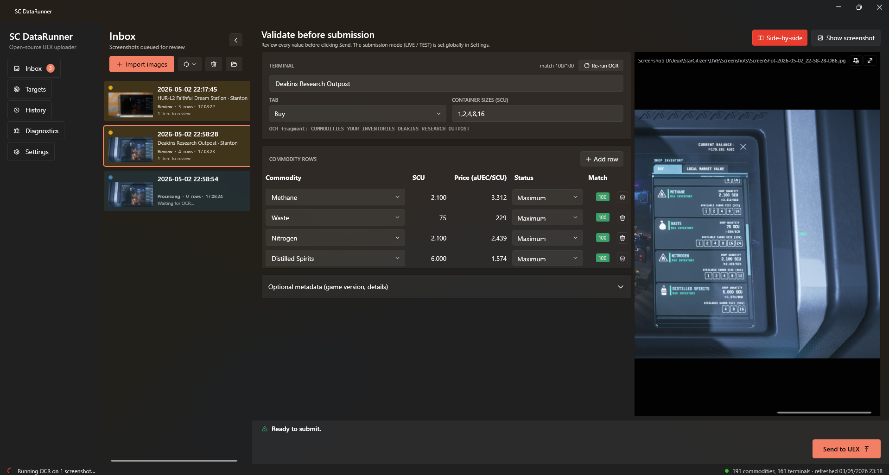

# SC-DataRunner

> An open-source Star Citizen commodity terminal scanner that submits trade
> data to [UEX Corp](https://uexcorp.space) — fast OCR, manual review, one
> click. Built in .NET 9 / WPF, ships as a single Windows installer that
> auto-updates itself silently.

[](https://github.com/Olrik-WP/SC-DataRunnerNet/releases/latest)
[](https://github.com/Olrik-WP/SC-DataRunnerNet/releases)
[](https://github.com/Olrik-WP/SC-DataRunnerNet/actions/workflows/release.yml)
[](LICENSE)
[](https://dotnet.microsoft.com/download/dotnet/9.0)
[](#install)

---

## What it does

You take a screenshot of a commodity terminal in Star Citizen → SC-DataRunner
parses it locally, lets you review every value, then submits the result to
UEX Corp where the entire SC trading community benefits from up-to-date
prices.

```
[Print Screen in SC]      [SC-DataRunner picks it up]         [you click Send]
        ↓                          ↓                                ↓
ScreenShot-2026-...   →   Inbox card · OCR pipeline    →     UEX /data_submit
                          (~2-30s on CPU)                     (LIVE prices)
```

> ℹ️ In Star Citizen the screenshot key is **Print Screen** (`Impr. écran`
> on FR keyboards), **not** F12. Files land in
> `<SC install>\LIVE\Screenshots\` by default — that's the folder
> SC-DataRunner watches.



### Why use this over the existing tools?

- **Open-source under AGPL-3.0** — you can audit every byte, fork it, run
  your own UEX app, or ship a private build. No closed binaries from a
  random Discord download.
- **Multilingual fonts handled out of the box** thanks to PaddleOCR (vs.
  Tesseract-only in older tools).
- **Real validation pipeline** — fuzzy match against the UEX catalog, length
  penalty to kill the classic "Stims → Tin" false positive, status-leak
  protection, container-size union across rows, live diff vs. the current
  UEX price before submission.
- **Stale-target view** — built-in tab that pulls `commodities_prices_all`
  from UEX and tells you which `(terminal, commodity)` pairs are most
  outdated, so you can plan a route that actually helps the database.
- **Side-by-side review** — toggle a docked screenshot panel next to the
  validation form, with click-and-drag pan and mouse-wheel zoom; great
  on ultrawide monitors, still usable on 1080p once the inbox is collapsed.
- **Diagnostics tab + one-click bug report** — copies your version, recent
  log tail, last 5 submissions and prefs to the clipboard, ready to paste
  into a GitHub issue. No screenshots of logs, no zip-and-attach.
- **No Python runtime to install.** Single signed Windows installer, ~50 MB.
  .NET 9 runtime is bundled, you don't need to install anything else.
- **Silent auto-updates** via [Velopack](https://github.com/velopack/velopack) —
  every fix lands in your build the same week it ships, with a discreet
  pill in the status bar so you stay in control of when to apply it.
- **Privacy-first**: OCR runs entirely on your machine, the screenshot file
  is only attached to a UEX submission AFTER you click Send (and you can
  disable that attachment in Settings).

---

## System requirements

- **Windows 10 21H2** or newer (Windows 11 recommended for Mica titlebar).
- **~250 MB free disk** (~50 MB installer + ~150 MB OCR models downloaded
  on first OCR run + a few MB of cache & history).
- **No GPU required.** OCR runs on CPU; ~2-30 s per screenshot depending
  on your CPU. An NVIDIA GPU edition is on the roadmap.
- **Star Citizen LIVE** screenshots in PNG or JPG (the in-game default).
- A **UEX user secret-key** ([uexcorp.space → Account → Secret Key](https://uexcorp.space/account/home)).

---

## Install

### End user (recommended)

1. Download the latest `SC-DataRunner-win-Setup.exe` from
   [Releases](https://github.com/Olrik-WP/SC-DataRunnerNet/releases/latest).
2. Run it. The installer is signed and self-contained (~50 MB).
3. The first launch shows a 3-step wizard:
   - paste your **UEX user secret-key** (from
     [uexcorp.space → Account → Secret Key](https://uexcorp.space/account/home))
   - point to your SC `Screenshots` folder (the wizard pre-fills the standard
     location, including `D:\Jeux\StarCitizen\LIVE\Screenshots` and friends)
   - that's it — auto-update is on by default.

You do **NOT** need to register your own UEX application. The official build
ships with one embedded so the tool works out of the box.

### Self-build (developer / fork)

```pwsh
git clone https://github.com/Olrik-WP/SC-DataRunnerNet
cd SC-DataRunnerNet
dotnet build SC-DataRunnerNet.sln -c Release
```

If you want your own UEX app token baked in (so you control the rate-limit
quota of your fork), set the MSBuild property at build time:

```pwsh
$env:UexAppBearerToken = 'paste-your-token-here'
dotnet publish src/DataRunner.App.Wpf/DataRunner.App.Wpf.csproj -c Release -r win-x64 --self-contained
```

Without that property, the wizard adds a 4th step to ask the user for their
own UEX app token (`Settings → App bearer token (advanced)` lets them
override at any time).

### Uninstall / reset

- **Uninstall the app**: `Settings → Apps → SC-DataRunner → Uninstall`
  (standard Windows uninstaller — it removes the binaries but **keeps your
  data**).
- **Wipe local data too** (history DB, prefs, cached catalog, encrypted
  secret-key, logs): delete the folder
  `%LOCALAPPDATA%\SC-DataRunnerNet\`.
- **Revoke API access on UEX** if you're done with it: regenerate your
  secret-key from [uexcorp.space → Account](https://uexcorp.space/account/home).

---

## Your first upload (60-second tour)

1. Take a screenshot of any commodity terminal in Star Citizen with
   **Print Screen** (`Impr. écran`).
2. Alt-tab to SC-DataRunner — the new file pops in the **Inbox** within a
   second, OCR runs (~2-30 s), the card turns green when ready.
3. Click the card. The validation editor opens. Cross-check SCU / price /
   status against the screenshot — toggle **Side-by-side** if you want
   the image docked next to the form.
4. Fix any orange/red row (orange = warning, red = blocking; the override
   checkbox lets you ship anyway after manual review).
5. Click **Send**. The confirmation dialog shows the live diff vs UEX
   prices and the exact JSON about to be POSTed. Confirm → done.
6. The card moves to **History**, the screenshot is auto-deleted (if
   that preference is on), and your submission counts toward UEX
   datarunner stats.

> 💡 **Tip**: open the **Targets** tab first to see which terminals are
> the most stale — you'll farm the most useful submissions in the same
> trip.

---

## How it works (quick tour for contributors)

### Pipeline

```
┌─────────────────────────┐
│ ScreenshotFolderWatcher │  watches the SC Screenshots folder, debounces
└────────────┬────────────┘  partial writes, dedupes already-submitted files
             ↓
┌─────────────────────────┐
│ OcrCoordinator (queue)  │  serialises OCR jobs, marshals UI updates
└────────────┬────────────┘
             ↓
┌─────────────────────────┐
│ PaddleOcrPipeline       │  3 passes: top banner / left header / right panel
│ + ImagePreprocessor     │  CLAHE + ×2 upscale + horizontal-region grouping
│ + RegionLayout          │  reconstruct 2-D layout from per-region bboxes
│ + aggressive retry      │  re-OCR with stronger preprocessing if a terminal
└────────────┬────────────┘  name or status came back empty
             ↓
┌─────────────────────────┐
│ CommodityParser         │  regex + fuzzy match against the UEX catalog,
│ + FuzzyMatcher          │  length penalty, status barriers, container UNION,
│                         │  OutOfStock → SCU=0 fallback
└────────────┬────────────┘
             ↓ ParsedSubmission + UexDataSubmitPayload
┌─────────────────────────┐
│ ScreenshotEditViewModel │  live validation, override checkbox, manual edits,
│ + ScreenshotPanel       │  optional side-by-side screenshot panel
└────────────┬────────────┘
             ↓ user clicks Send
┌─────────────────────────┐
│ ConfirmSubmitDialog     │  validation report + LIVE diff vs UEX prices +
│ + DuplicateChecker      │  exact wire-JSON preview, FINAL gate before POST
└────────────┬────────────┘
             ↓
┌─────────────────────────┐
│ UexApiClient            │  POST /data_submit with secret-key + bearer
│ + SqliteSubmissionHistory  audit log of every request/response, locally
└─────────────────────────┘
```

### Five tabs in the UI

| Tab | What's in it |
|---|---|
| **Inbox** | Auto-imported screenshots, OCR status, multi-select + merge, validation editor |
| **Targets** | Stale `(terminal, commodity)` pairs from UEX, sortable by age — plan a route |
| **History** | Local audit log of every submission (request + response JSON) |
| **Diagnostics** | App version, log viewer, recent submission inspector, **one-click bug report** to clipboard |
| **Settings** | Secret key, bearer token override, screenshots folder, default mode (production/test), preferences |

### Project layout

```
src/
├── DataRunner.Core/          ← models, abstractions, no third-party deps
├── DataRunner.UexClient/     ← UEX API + DPAPI secret store + SQLite history
├── DataRunner.Ocr/           ← PaddleOCR pipeline + parsers + matcher
└── DataRunner.App.Wpf/       ← the WPF / MVVM UI (only platform-specific module)

spike/
└── DataRunner.OcrSpike/      ← throw-away CLI for OCR experiments

scripts/
└── release.ps1               ← interactive release helper (bump → tag → push)

.github/workflows/
└── release.yml               ← CI build + Velopack pack + GitHub Release
```

### Building from source

| Need | Command |
|---|---|
| Restore + build | `dotnet build SC-DataRunnerNet.sln` |
| Run the WPF app | `dotnet run --project src/DataRunner.App.Wpf` |
| Pack a self-contained installer | `pwsh ./scripts/release.ps1 -Mode local` |
| Release a public version | `pwsh ./scripts/release.ps1 -Bump patch -Mode ci` |

The release script asks you what kind of bump (`patch` / `minor` / `major`),
commits the new `<Version>` in `Directory.Build.props`, and pushes the
matching `v1.2.3` tag. The CI workflow does the rest — Velopack packs +
uploads to GitHub Releases, existing users auto-update within hours.

### Auto-update flow (Velopack)

1. App launches → silent background `CheckForUpdatesAsync` against the
   GitHub Releases feed.
2. If a newer version exists, the status bar shows a small **"Update
   available"** pill. Click it to open Settings.
3. From Settings you choose Download → Apply. The installer streams the
   delta, replaces the binaries on the next restart, no UAC prompt, no
   re-installation, your data dir is preserved.

You can also force a check from `Settings → Updates`. Velopack handles
rollback if the new build fails to start.

### Bearer-token security model (important)

The official CI build embeds the UEX app bearer token via
`[AssemblyMetadata("UexAppBearerToken", ...)]` so end users never have to
register their own UEX app. The token is **extractable** from the binary
(strings.exe, ILSpy, ...) — same trade-off every datarunner tool on the
market makes.

If the token ever leaks publicly:

1. Go to [uexcorp.space/api/apps](https://uexcorp.space/api/apps), click
   "Regenerate" on the SC-DataRunner app.
2. Update the GitHub Actions secret `UEX_APP_BEARER_TOKEN`.
3. `pwsh ./scripts/release.ps1 -Bump patch` → push the tag.
4. Velopack delivers the new build to all users on next launch (typically
   within a few hours).

End-user data (their UEX secret-key, their submission history) is encrypted
locally with Windows DPAPI and never leaves the machine — even if the bearer
token leaks, no user data is at risk.

---

## OCR accuracy & known limits

### What works well

- Terminal name recognition: ~99% on clean screenshots, with disambiguation
  for terminals that share a name across star systems (e.g. "Pyro Gateway"
  vs. "Stanton Gateway") — confirmed by the `RichDisplayName` warning in
  the editor.
- Commodity name matching: ~95-99% with the length-penalty fuzzy matcher
  protecting against false positives.
- Container sizes: 1, 2, 4, 8, 16, 24, 32 picked up with UNION across rows
  (so the smaller sizes that the OCR sometimes misses on one row are
  recovered from another).
- Status detection (`MAX INVENTORY`, `LOW INVENTORY`, ...) tolerates the
  most common OCR errors (M↔N, 0↔O, period inserted between words). When
  status is `OUT OF STOCK` and SCU isn't recognised, SCU is set to 0
  automatically — a missing 0 is no longer a blocking error.
- Aggressive retry pass (CLAHE clipLimit 4.0, ×3 upscale, unsharp mask)
  re-runs whenever the first pass returned an empty terminal name or any
  Unknown status, and merges results back without overwriting good values.

### What still needs your eye

- Status labels are sometimes missed entirely on rows where an icon abuts
  the text (the typical "bag-icon" rows on Daekens Research Outpost). The
  Status combobox is tinted **orange** when this happens — pick the right
  value before clicking Send.
- Match scores below 100% always trigger a warning, even when the right
  commodity was picked. The override checkbox in the validation footer
  lets you ship anyway after manual review.
- Numeric typography in SC is glow-heavy at 1080p; values >9 999 999
  occasionally lose a digit. Always cross-check the SCU and price against
  the screenshot — toggle the **Side-by-side** screenshot panel in the
  editor for a docked, zoomable view that stays in sync with the form.

---

## Roadmap

### Done
- ✅ End-to-end OCR pipeline with manual review UI
- ✅ DPAPI-encrypted credential storage
- ✅ SQLite submission audit log
- ✅ Velopack silent auto-update + signed installer
- ✅ Validation footer with live diff vs UEX prices + override checkbox
- ✅ Multi-screenshot merge (one terminal, many screenshots → one submission)
- ✅ Built-in app token embedded at build, override possible in Settings
- ✅ Stale-target view (Targets tab) — `commodities_prices_all` sorted by age
- ✅ Side-by-side screenshot panel (toggle) + collapsible inbox
- ✅ Diagnostics tab — log viewer, submission inspector, one-click bug report
- ✅ Aggressive OCR retry pass for missing terminal names / Unknown status
- ✅ OutOfStock → SCU=0 inference (no longer a blocking error)
- ✅ Terminal disambiguation across star systems (e.g. Pyro vs. Stanton)

### Next — extend coverage to other UEX submission types

The UEX `data_submit` endpoint actually accepts **7 categories** of pricing
data via its `type` field. Today we only cover **commodities**. The other
six are submission types where community coverage is much weaker — and
they all use a similar in-game UI we could OCR with the same pipeline.

| Phase | Type | In-game source | OCR effort | Why it matters |
|---|---|---|---|---|
| **🔜 Phase 1** | `item` | Shop terminals (Cubby Blast, Centermass, Garrity, OmegaPro, medical / food vendors, sub-gear bornes) | Low — same SCU/price layout, parser ~90 % reusable | Coverage is **catastrophic** today. Biggest single quality-of-life win for UEX. |
| **🔜 Phase 2** | `fuel` | Refuel terminals (Quantum + Hydrogen) at any station | Low — 2-line panel, trivial parsing | Critical for long-distance route planning; prices vary a lot per station. |
| **🔜 Phase 3** | `vehicle_purchase` + `vehicle_rental` | ASOP terminals (Lorville, Area18, ...) + New Deal Showroom | Medium — different layout, ship list view | Many bornes uncovered; ASOP rental prices barely tracked. |
| **🔜 Phase 4** | `ore` | Refinery sell terminals (ARC-L1, HUR-L1, MAG-L4, CRU-L1, ...) | Medium-Heavy — dense table, multi-column | Direct raw-ore sales; medium coverage today. |

Each phase reuses the existing pipeline (folder watcher, OCR queue,
PaddleOCR, fuzzy matching against the UEX catalog, validation editor,
live diff, audit log) — only the per-type parser, the catalog lookup
(`/items`, `/fuel_prices`, `/vehicles`, ...) and a few new validation
rules need to change.

> Out of scope for this client: **`vehicle_pledge`** prices come from the
> RSI Pledge Store website, not from in-game UI, so they don't match the
> screenshot-driven workflow.

### Also considered (no commitment yet)

- **Refinery yields** (`data_submit_refinery`) — submit refining-job
  results (input ore → output, method, duration). Niche but very valuable
  for miners. Different workflow (track a job over time, not a one-shot
  screenshot).

### Maybe later

- ⏳ GPU edition (PaddleOCR on CUDA) for power users with NVIDIA GPUs.

---

## Reporting bugs

Open the **Diagnostics tab → "Copy bug report"**, then paste into a new
[GitHub issue](https://github.com/Olrik-WP/SC-DataRunnerNet/issues/new).
The clipboard payload contains:

- App version + .NET runtime + OS
- Data folder location and DB size
- Catalog state (commodities/terminals counts, last refresh time)
- Non-secret preferences (your bearer/secret keys are **never** copied)
- Last 5 submissions: terminal, HTTP status, API status, message
- Last 50 lines of the current log file

If you can attach the SC terminal screenshot that triggered the bug,
even better — but the report alone is usually enough to reproduce.

---

## Contributing

PRs welcome. The codebase is heavily commented because OCR is full of
non-obvious trade-offs — every "weird" decision should have a comment
explaining why and what was tried before. Please keep that convention if
you submit changes.

Useful starting points:

- Want to improve OCR accuracy? `src/DataRunner.Ocr/Pipeline/CommodityParser.cs`
  and `src/DataRunner.Ocr/Matching/FuzzyMatcher.cs` are where most of the
  heuristics live.
- Want to add a new validation rule? `ScreenshotEditViewModel.RecomputeValidation`
  is the entry point.
- Want to tweak the screenshot panel UX? `Views/ScreenshotPanel.xaml(.cs)` —
  it powers both the side-by-side view and the standalone window.

Code style: standard `dotnet format`. The CI runs it on every push.

---

## License

This project is licensed under the **GNU Affero General Public License v3.0
or later** — see [LICENSE](LICENSE) for the full text.

In short: you can use, modify, and redistribute it freely, but if you run
a modified version as a network service (or distribute it), you must make
your modifications available under the same license. This is intentional:
the SC datarunner ecosystem benefits from improvements being shared back.

---

## Community

- 🐛 **Bug?** [Open a GitHub issue](https://github.com/Olrik-WP/SC-DataRunnerNet/issues/new)
  with the output of `Diagnostics → Copy bug report`.
- 💬 **UEX datarunner Discord channel** — best place to chat about
  data-quality, terminal coverage, and trade-route planning.
- ⭐ **Star the repo** if it helps you. It's the only way I know the tool
  is useful to people outside my own crew.

---

## Acknowledgments

- [UEX Corporation](https://uexcorp.space) for hosting the API and
  curating the catalog of commodities and terminals.
- [PaddleOCR](https://github.com/PaddlePaddle/PaddleOCR) /
  [Sdcb.PaddleSharp](https://github.com/sdcb/PaddleSharp) for the OCR
  engine.
- [WPF-UI](https://github.com/lepoco/wpfui) for the Fluent design system
  components.
- [Velopack](https://github.com/velopack/velopack) for the silent auto-update
  story.
- The SC datarunner Discord community for the original Python reference
  implementation that proved the workflow viable, and for the patient
  feedback during development.

⚠️ This is an unofficial fan-made tool. Star Citizen and the Roberts Space
Industries logo are trademarks of Cloud Imperium Rights LLC. This project is
not affiliated with, endorsed by, or sponsored by Cloud Imperium.
